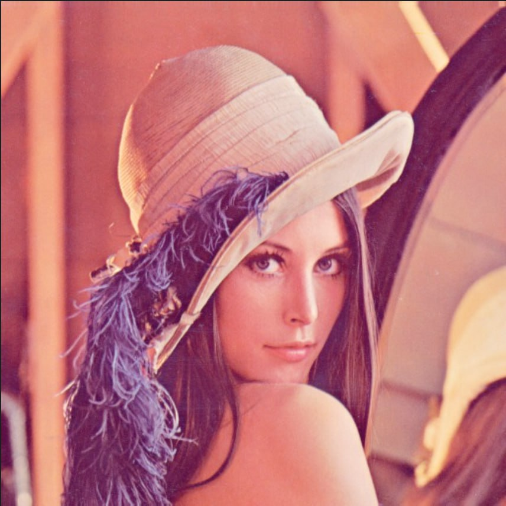
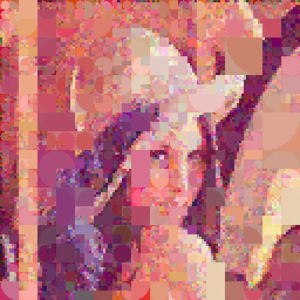

# Stylized Image Reconstruction Using Quadtree-Based Genetic Algorithm

This project reconstructs a target image using a quadtree-based genetic algorithm that mutates color regions, evaluates fitness against the source image, and keeps stronger candidates through selection and crossover. The optimization runs tile-by-tile in parallel to improve runtime while preserving local structure, and the CLI supports reproducible experiments through configurable parameters such as generations, population size, subdivision level, and output resolution.

---

## How It Works

1. The input image is resized to the working resolution.
2. The image is split into `2^subdivision_level` tiles per axis.
3. Each tile evolves in parallel with a genetic loop:
   - mutate colors for selected quads
   - evaluate fitness against the source tile
   - apply crossover and quad subdivision
4. Evolved tiles are merged back into final full-size images.

## Repository Structure

- `image_generation/` - source code
- `input/` - input images
- `output/` - generated outputs (cleaned each run)
- `examples/` - README demo assets (before/after)

## Requirements

- Python 3.12+
- pip

Install dependencies:

```bash
python -m pip install -r requirements.txt
```

## Run Instructions

From the repository root:

```bash
python -m image_generation -- -i lady.jpg
```

This uses defaults for all other arguments and expects `input/lady.jpg`.

Show help:

```bash
python -m image_generation -- --help
```

## Common Examples

Default run:

```bash
python -m image_generation -- -i lady.jpg
```

Current quality profile (about 2 minutes on this project setup):

```bash
python -m image_generation -- -i lady.jpg -o output -g 36 -ps 80 -c 40 -cg 30 -wr 256 -or 512 -sl 2 -s 0 -st false
```

Enable statistics and chart:

```bash
python -m image_generation -- -i lady.jpg -st true
```

Render evolution as an animated GIF:

```bash
python -m image_generation -- -i lady.jpg -a
```

Render animation at 16 FPS:

```bash
python -m image_generation -- -i lady.jpg -a -as 16
```

## CLI Arguments

| Description | Argument | Default |
|---|---|---|
| Input filename | `-i`, `--input` | `input` |
| Output folder | `-o`, `--output` | `output` |
| Generations | `-g`, `--generations` | `36` |
| Population size | `-ps`, `--population-size` | `80` |
| Crossover size | `-c`, `--crossover` | `40` |
| Color generations | `-cg`, `--color-generations` | `30` |
| Working resolution | `-wr`, `--working-resolution` | `256` |
| Output resolution | `-or`, `--output-resolution` | `512` |
| Subdivision level | `-sl`, `--subdivision-level` | `2` |
| Random seed | `-s`, `--seed` | `0` |
| Statistics output | `-st`, `--statistics` | `false` |
| Animated GIF output | `-a`, `--animated` | `false` |
| Animation speed (FPS) | `-as`, `--animation-speed` | `12` |
| Help | `-h`, `--help` | n/a |

## Before / After Example

Input (`lady.jpg`):



Generated output (`output_0.jpg` from the current profile):



## Output Files

Each run writes:

- `output/output_0.jpg` ... `output/output_4.jpg` - ranked image outputs (default mode)
- `output/output.gif` - animated mutation timeline when `-a` is enabled
- `output/run_data.txt` - runtime and run configuration
- `output/evo_data.txt` - evolution settings
- `output/stat_data.txt` - tile/generation statistics
- `output/graph.png` - statistics chart when `-st true`

## Notes

- The `output/` folder is cleaned at the start of every run.
- If you pass a bare filename like `lady.jpg`, the program resolves it as `input/lady.jpg`.
- You can pass a direct path too, for example `-i ../somewhere/image.jpg`.
